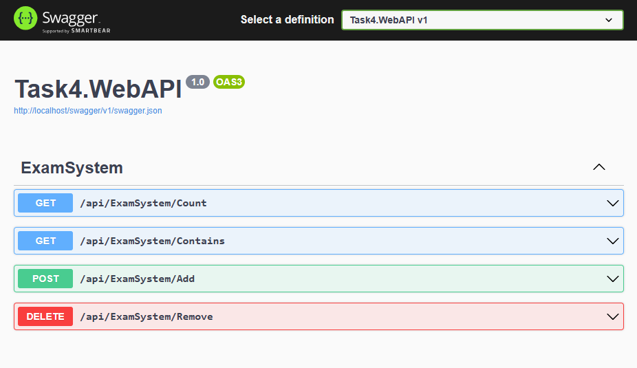
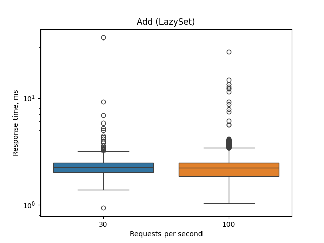
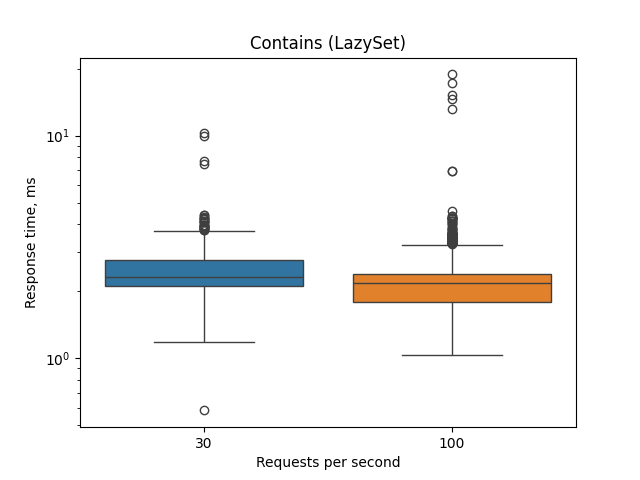
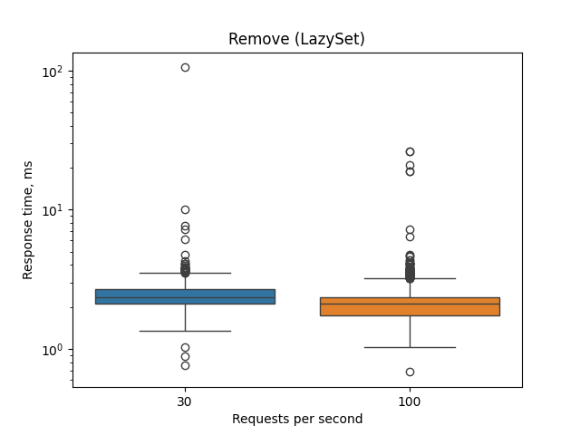
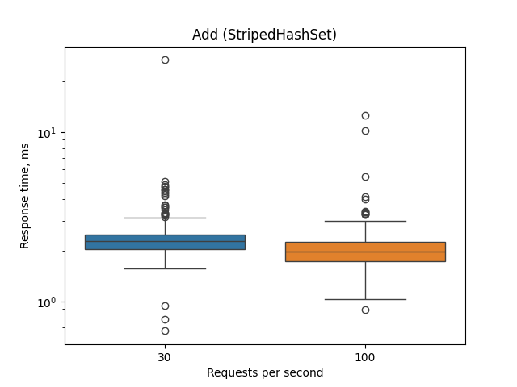
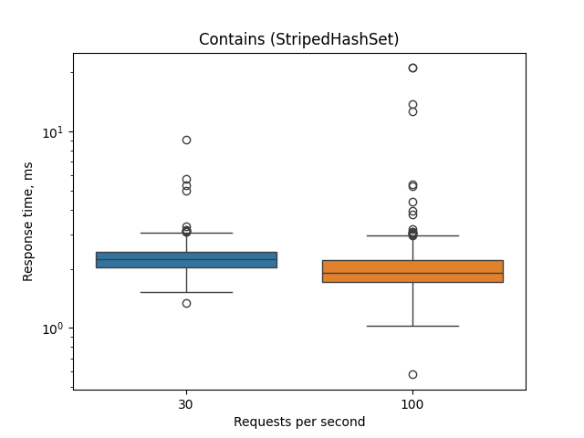
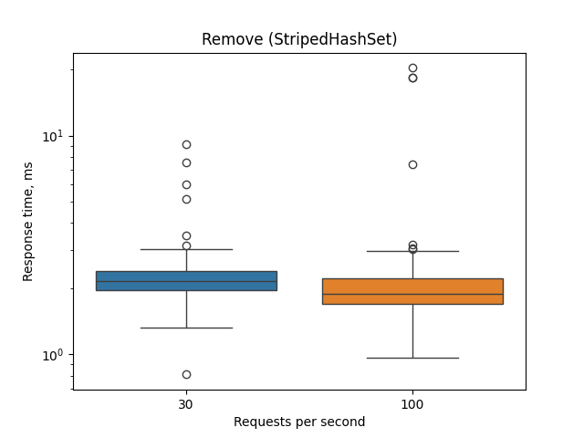

# Task4

Exam system implemented in C#, supporting 2 types of concurrent set and providing web API on ASP.NET.

## Prerequisites
For local build:
- `.NET 7.0 SDK`
- `NUnit`
- `ASP.NET Core 7.0`

For load testing:
- `k6 v0.51+`
- `python 3` (visualization)
  - `pandas`
  - `matplotlib`
  - `seaborn`

## Docker
### Build
Run from solution folder (/Tasks):
```powershell
docker build -f Task4\Task4.WebAPI\Dockerfile -t task4.webapi .
```
### Run
```powershell
docker run -it -p 80:80 task4.webapi
```
The following environment variables are supported:
- `ASPNETCORE_ENVIRONMENT` - application runtime environment. Available options are **Development** / **Staging** / **Production**.
- `SET_TYPE` - indicates internal concurrent set implementation. Options are **LazySet** (default) / **StripedHashSet**.

Example:
```powershell
docker run -it -p 80:80 -e SET_TYPE=StripedHashSet -e ASPNETCORE_ENVIRONMENT=Development task4.webapi
```

## Usage
Exam system should now be available on *localhost*, port *80*. Base API url: *http://localhost/api/ExamSystem*.

### Web API:
- **GET** `/Count` - get the current total number of credits
- **GET** `/Contains` (studentId, courseId) - check if credit present in the system
- **POST** `/Add` (studentId, courseId) - add new credit to the system
- **DELETE** `/Remove` (studentId, courseId) - remove credit from the system

### Swagger:
Available only in **Development** environment at url: *http://localhost/swagger/index.html*.



## Load tests
Run from *Task4.LoadTests/* folder:
```powershell
k6 run --out csv=[csv_filename] load_test.js
```
Draw plots:
```powershell
python loadtest_plots.py [csv_filename] [set_name] [save_folder]
```
Example:
```powershell
k6 run --out csv=load_test_lazyset.csv load_test.js
python loadtest_plots.py load_test_lazyset.csv LazySet pics/lazyset/
```
### Results

**LazySet**





**StripedHashSet**





## Stress tests
Run from Task4.LoadTests/ folder:
```powershell
k6 run stress_test.js
```
### Results
| Set | Timeout | PCU | Records | 
| --- | --- | --- | --- |
| LazySet | 5s | 6893 | 3577 |
| StripedHashSet | 5s | 9164 | 6059 |

- PCU - Peak Concurrent Users

## Project structure
```
.
├── README.md - task description, results
├── Task4.Implementation - project containing an implementation of ExamSystem and related entities
│   ├── Common/ - general purpose classes
│   ├── ConcurrentSet/ - implementations of concurrent set
│   └── ExamSystem/ - exam system implementation
├── Task4.UnitTests - project containing unit tests for ExamSystem and concurrent sets
├── Task4.WebAPI - web API wrapper for ExamSystem
└── Task4.LoadTests - load & stress testing, visualization scripts 
```