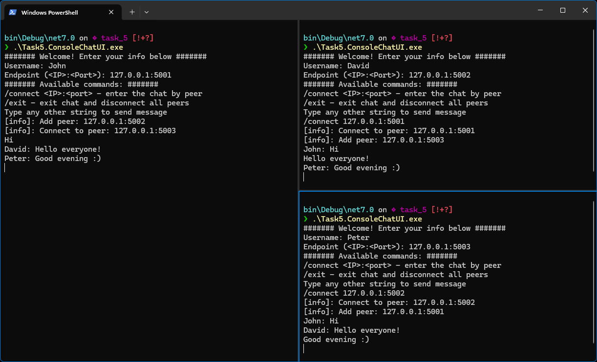

# Task5

**Peer-To-Peer** chat implementation in C# using sockets. The chat system is designed for a small number of users (however, there is no maximum limit), based on the TCP protocol and a fully-connected topology.

## Prerequisites
- `.NET 7.0 SDK`
- `NUnit`

## Usage 
The chat system is available through the console user interface. First you need to enter your *Username* and the *Endpoint* on which listening for incoming connections will be enabled. You can then connect to the other peer using the `/connect` command, or wait until someone connects to you. You can leave the chat using the `/exit` command.

### Example


## Project structure
```
.
├── README.md - task description
├───Task5.Implementation - chat system backend, implementation of the peer
│   ├───Common/ - general purpose classes
│   ├───Message/ - chat message type
│   ├───Utils/ - helper classes for ChatPeer
│   └───ChatPeer.cs - main class
├───Task5.ConsoleChatUI - console UI wrapper for ChatPeer
└───Task5.UnitTests - project containing unit tests for ChatPeer and related entities
```